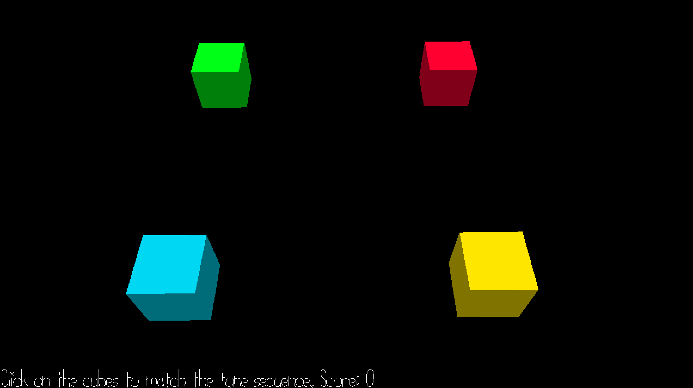

# Match that Tune

Author: Sarah Pethani

Design: A simon-says type game where the player needs to replicate a sequence that gets longer after every round. The catch is that you have to recreate the sequence purely based on sound!

Screen Shot:

How To Play:

A tune will play. Recreate the tune by clicking on cubes; each cube makes a different sound. If the sequence you play is different than the tune played, the round will restart. If you repeat it correctly, the sequence will have another sound added to the end of it. 

This game was built with [NEST](NEST.md).
